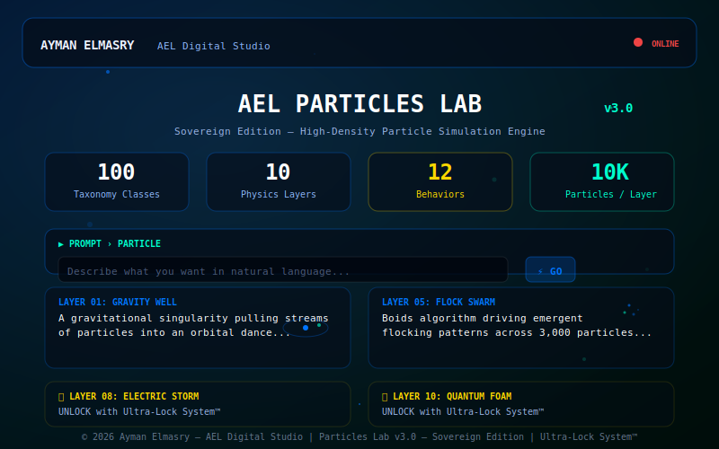

# AEL | PARTICLES LAB v3.2 — Sovereign Edition

> **High-density particle simulation engine** with 100 taxonomy classes, 10 physics layers, real-time rendering, and a generative prompt-to-particle engine.  
> Generated by the AEL Digital Framework — a combinatorial engine that synthesizes unique particles from natural language descriptions.  
> Built by Ayman Elmasry — AEL Digital Studio.

---

## Preview



---

## Table of Contents

- [Features](#features)
- [How It Works](#how-it-works)
- [Project Structure](#project-structure)
- [Getting Started](#getting-started)
- [Usage](#usage)
- [Layer Taxonomy](#layer-taxonomy)
- [Generative Engine](#generative-engine)
- [Preset System](#preset-system)
- [Technical Details](#technical-details)
- [Credits](#credits)

---

## Features

- **100 particle classes** — 10 layers × 10 particles each (Physics, Visual, Procedural, AI Behavioral, Fluid Dynamics, GPU Compute, State Lifecycle, Environment Forces, Hybrid Composite, Advanced Quantum)
- **10 unique physics layers** — each with distinct visual themes, background patterns, particle shapes, colors, and glow effects
- **Generative Engine v3.2** — describe what you want in natural language and get a synthesized MetaParticle with 12 behaviors, 6 shapes, 10 colors
- **Prompt › Particle** — supports 160+ English + 25 Arabic keywords, plus unlimited generative combinations
- **Real-time rendering** — 2,000–10,000 particles per layer with batched rendering optimization
- **Search & Filter** — live taxonomy filtering as you type
- **Preset System** — save/load config in localStorage, share URL copied to clipboard
- **Performance Graph** — real-time FPS sparkline chart on canvas
- **Mobile Drawer** — hamburger toggle with slide-in taxonomy panel + overlay
- **Toast notifications** — non-blocking status messages
- **Connection lines** — visual spring constraints on Hybrid Composite layer (≤ 2,500 particles)
- **Spatial grid optimization** — fast particle updates with boundary clamping
- **Mouse interaction** — particles respond to cursor in AI Behavioral layer
- **Sovereign Identity Block** — AEL Digital Framework with owner verification

---

## How It Works

### Rendering Engine

The engine merges two source architectures:
- **v2.0 high-density core** (`alpha: false`, `fillRect`, squared distance) for maximum particle throughput
- **v1.0 visual quality** (arc particles, connection lines, sticky headers, cyber corners) for aesthetic polish

Particle counts scale per layer (2,000–10,000) to balance density with FPS. Connection lines are drawn only on Hybrid Composite layer to avoid performance degradation.

### Layer Personalities (v3.1)

Each layer has a unique visual theme:

| Layer | Background | Shape | Glow |
|-------|-----------|-------|------|
| 01 Gravity Well | Gravity lines | Circle | Blue radial |
| 02 Visual Flux | Radial glow | Rectangle | Cyan pulse |
| 03 Procedural | Noise grid | Diamond | Purple wave |
| 04 AI Behavioral | Spotlight | Triangle | Green trace |
| 05 Fluid Dynamics | Wave field | Streak | Aqua stream |
| 06 GPU Compute | Data grid | Circle | Red scan |
| 07 State Lifecycle | Pulse rings | Rectangle | Gold ring |
| 08 Environment Forces | Wind vectors | Diamond | White streak |
| 09 Hybrid Composite | Mesh grid | Triangle | Multi glow |
| 10 Advanced Quantum | Sparkle noise | Streak | Quantum flicker |

### Generative Engine (v3.2)

The `parsePrompt` function analyzes natural language input and generates a `MetaParticle` with:

| Dimension | Options |
|-----------|---------|
| **12 Behaviors** | gravity, bounce, follow, avoid, wander, sine, spiral, orbit, explode, float, flock |
| **6 Shapes** | circle, rect, triangle, diamond, streak, star |
| **10 Colors** | white, blue, cyan, red, green, purple, orange, pink, gold, rainbow + pulse/gradient modes |
| **Element Presets** | fire, water, smoke, ice, lightning, magic, shadow, wind |
| **Effects** | flutter, teleport, fade, respawn |

### Generation Algorithm

1. User enters a natural language prompt (e.g. "floating blue fire particles")
2. `parsePrompt` tokenizes and matches keywords against 160+ English + 25 Arabic entries
3. Matched tokens map to behavior, shape, color, and element parameters
4. A new `MetaParticle` object is synthesized — not a taxonomy lookup
5. The particle is rendered in real-time on the selected layer

---

## Project Structure

```
ael-particles-lab/
├── index.html              # HTML5 structure with Tailwind CSS
├── ael_particles_lab.css   # All styles (glassmorphism, cyber corners, scanlines)
├── ael_particles_lab.js    # Full JS engine (rendering, taxonomy, generative, UI)
├── screenshot.svg          # Project preview image
├── ael-logo.svg            # AEL brand logo
├── .gitignore
├── .nojekyll               # Required for GitHub Pages
└── README.md
```

This separation follows modern web best practices:
- **HTML5** — semantic elements with RTL support for Arabic
- **CSS3** — custom properties, glassmorphism, cyber corners, scanline overlays
- **Vanilla JS (ES2020+)** — zero dependencies, runs in any modern browser

---

## Getting Started

### Run Locally

```bash
git clone https://github.com/aymanelmasryael/ael-particles-lab.git
cd ael-particles-lab
open index.html
```

Or simply open `index.html` in any modern browser — no server required.

### Prerequisites

- A modern web browser (Chrome, Firefox, Safari, Edge)
- Internet connection on first load (for Tailwind CSS & Google Fonts CDN)
- No build tools, no package managers, no server

---

## Usage

### Browse Taxonomy
- Open `index.html` — 100 particle classes load in the left panel
- Click any class to switch physics behaviors and visual themes instantly

### Generate from Prompt
- Type a description in the **Prompt › Particle** input (e.g. "fire", "blue water wave", "غبار كوني")
- Click the generate button (⚡) — a new MetaParticle is synthesized

### Search & Filter
- Type in the search box to filter the taxonomy in real-time
- Matches against particle names, layer names, and descriptions

### Save & Share
- Click **SAVE** to store the current config in localStorage
- Click **LOAD** to restore a saved config
- Click **SHARE** to copy a shareable URL to clipboard

### Mobile
- On mobile devices, use the hamburger menu (☰) to toggle the taxonomy panel
- The panel slides in as a drawer with an overlay backdrop

---

## Layer Taxonomy

| # | Layer Name | Particle Count | Behavior | Shape | Color Theme |
|---|-----------|---------------|----------|-------|-------------|
| 01 | Gravity Well | 5,000 | Gravity orbit | Circle | Blue |
| 02 | Visual Flux | 8,000 | Sine wave | Rectangle | Cyan |
| 03 | Procedural | 10,000 | Wander | Diamond | Purple |
| 04 | AI Behavioral | 3,000 | Follow/Avoid | Triangle | Green |
| 05 | Fluid Dynamics | 6,000 | Float/Drift | Streak | Aqua |
| 06 | GPU Compute | 8,000 | Spiral | Circle | Red |
| 07 | State Lifecycle | 4,000 | Explode/Respawn | Rectangle | Gold |
| 08 | Environment Forces | 7,000 | Wind/Vector | Diamond | White |
| 09 | Hybrid Composite | 2,500 | Multi-physics | Triangle | Multi |
| 10 | Advanced Quantum | 5,000 | Quantum flicker | Streak | Quantum |

---

## Preset System

- **Save** — stores current layer, active particle, and UI state in localStorage
- **Load** — restores a previously saved preset
- **Share** — encodes the current state as a URL query string and copies it to clipboard

---

## Technical Details

| Aspect | Detail |
|--------|--------|
| Architecture | Static site (HTML5 + CSS3 + JS) |
| JavaScript | Vanilla ES2020+, zero dependencies |
| CSS | Custom properties + Tailwind CSS |
| Icons | Unicode/emoji (no external icon library) |
| Canvas rendering | Batched `fillRect` with spatial grid optimization |
| Frame rate | 60fps target at 5,000 particles |
| Browser support | Chrome, Firefox, Safari, Edge (modern versions) |
| Offline | Works locally via `file://` |

### Performance

- 5,000 particles at 60fps on mid-range hardware
- Connection lines rendered only on Hybrid Composite layer (≤ 2,500 particles)
- Spatial grid partitioning for fast neighbor lookups
- DOM: taxonomy list rendered with minimal reflow

---

## Credits

**Created by:** Ayman Elmasry — AEL Digital Studio  
**Website:** [aymanelmasry.com](https://aymanelmasry.com)  
**Email:** [info@aymanelmasry.com](mailto:info@aymanelmasry.com)  
**License:** © 2026 Ayman Elmasry — AEL Digital Studio. All rights reserved.

### Connect

[LinkedIn](https://linkedin.com/in/aymanelmasryael) · [Instagram](https://instagram.com/aymanelmasryael) · [X](https://x.com/aymanelmasryael) · [CodePen](https://codepen.io/aymanelmasryael) · [GitHub](https://github.com/aymanelmasryael) · [Behance](https://behance.net/aymanelmasryael)

---

*AEL Prompt IP System v1.0 — Sovereign Identity Block*  
*AEL sovereign blockchain timestamp 2025*
